# Lab 3: Reverse Engineering (NOT READY)


READ: Any knowledge and techniques presented here are for your learning purposes only. It is **ABSOLUTELY ILLEGAL** to apply the learned knowledge to others without proper consent/permission, and even then, you must check and comply with any regulatory restrictions and laws.


## TODO:

* update instructions for kali linux: capa tool, IDA,
* tools section
* check figure references

The aim of this lab is to perform deep analysis of DearCry ransomware and demonstrate some techniques of malware analysis, and especially reverse engineering of malicious sample for educational purposes. Materials in this lab adapted from [LIFARS](https://lifars.com/wp-content/uploads/2021/04/DearCry\_Ransomware.pdf).

## 3.0. Introduction

The DearCry ransomware has been used in current attacks related to the exploitation of Microsoft Exchange Servers. Unlike other ransomwares, DearCry is special in terms of its complexity. It is very simple malware, and it could be reverse engineered in couple of minutes as we demonstrate in this paper. The main objective of this document is to provide not only the analysis of DearCry ransomware, but also to provide educational tips and tricks, which could be useful in the cybersecurity community and students of computer science.

## 3.1. Static Analysis

Static analysis is usually the initial stage of malware analysis. Commonly the samples are scanned with antivirus software and IOC scanners. This phase also includes the analysis of sample metadata, embedded strings, resources, imports and exports (in case of Portable executable files, .EXE), presence of macros and auto-open or auto-close actions (in case of Office Documents).

### 3.1.1. DearCry Sample

We will analyze the DearCry ransomware sample (often classified also as DoejoCrypt) obtained from [Malware Bazaar](https://bazaar.abuse.ch/sample/e044d9f2d0f1260c3f4a543a1e67f33fcac265be114a1b135fd575b860d2b8c6/). It is a portable executable file, and it is approximately 1.2 MB in size. This means that it is a relatively large malware sample. Download the sample using the "download sample" link, as shown in Figure 1.

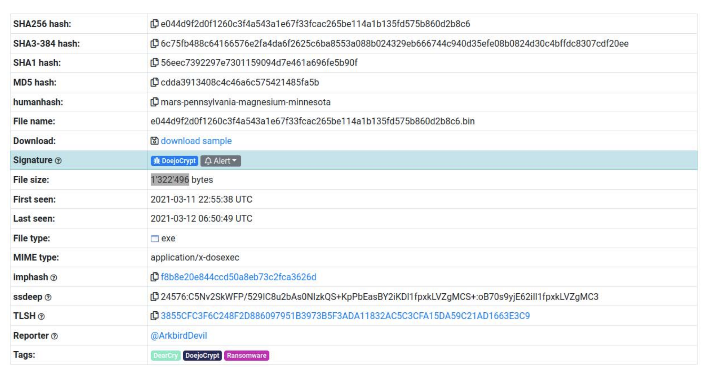

_Figure 1: DearCry Metadata from Malware Bazaar repository_

### 3.1.2. Strings

DearCry is very simple ransomware, as we can see even by extraction of the embedded strings. We use the `strings` command (Unix), or the Sysinternals tool called strings.exe (Windows).

> strings e044d9...bin
>
> or
>
> strings e044d9...exe

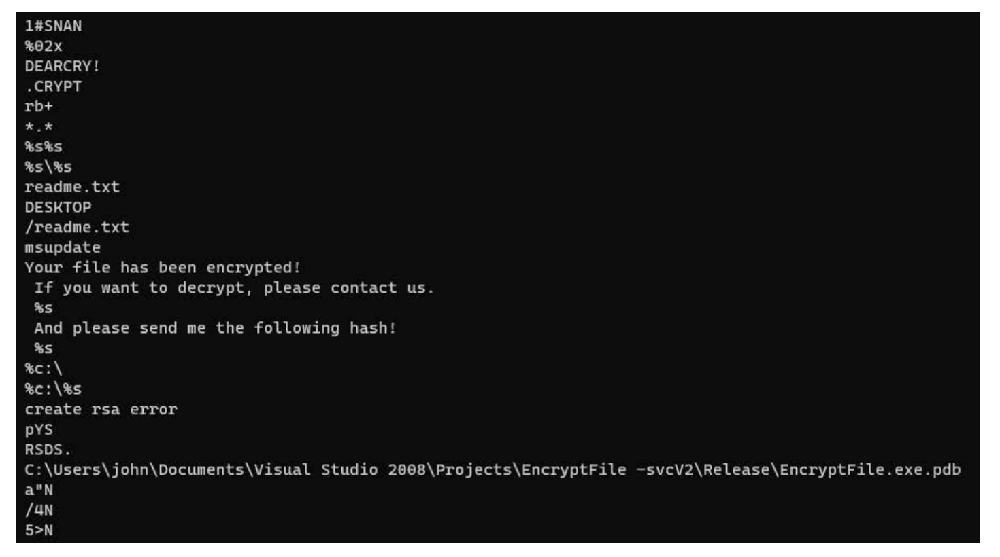

There is no obfuscation, all strings are clearly visible. For example, the ransom note. The sample leaks some debug information about its origin, too. From the PDB file path we can determine the username, used development tools and original name of the project.


RSA Public key is visible here, and also the list of file extensions. DearCry ransomware will probably encrypt files with these extensions, as we will see later.

### 3.1.3. Capabilities

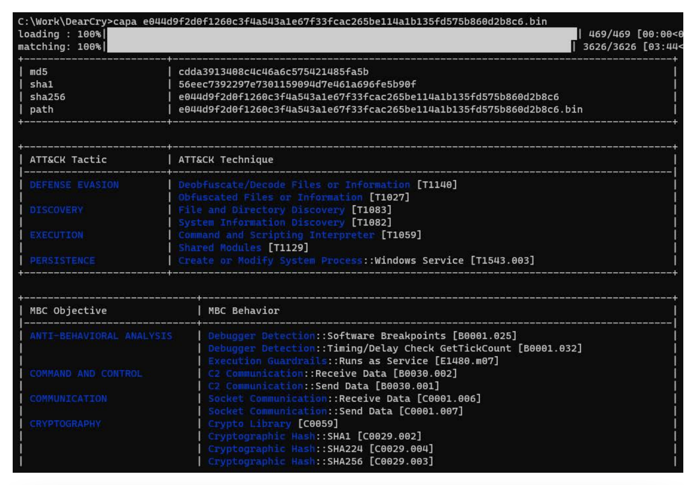


As a next step, we can quickly identify capabilities in the analyzed sample with the [capa tool](https://github.com/mandiant/capa).

> capa e044d9...bin
>
> or
>
> capa e044d9...exe

There is a lot of cryptography, ciphers, hashes. And it is linked against OpenSSL cryptography library.

## 3.2. Behavioural Analysis

During behavioral analysis, the sample is executed in a sandbox. This protected environment is monitored for any activities performed by the sample, such as spawning new processes, network communication, dropping files or overwriting the existent files. By reviewing of sample’s behavior, we can often say if the sample is malicious and if yes, what kind of malware it is (e.g., ransomware).

With behavioral analysis, we can also quickly collect a lot of indicators of compromise (IOC) which could be used by the rest of the team for effective incident response, forensic analysis, threat hunting or for monitoring and preventing threats in the customers’ infrastructure.

We will skip this step for now, because we already know that this is a DearCry ransomware sample which encrypts files. We will rather deep dive into the DearCry internals and code. We will demonstrate the process of reverse engineering the malware. However, we will later do a crosscheck of our findings with output from the sandbox, in this case, just for educational purposes.

## 3.3. Reverse Engineering

Reverse engineering is the phase in which we decompile or disassemble the machine instructions of program into more readable form. In this case, analyzed sample is a Portable Executable file produced by Microsoft Visual Studio compiler. We use IDA, Interactive Disassembler, for reverse engineering of this DearCry sample. IDA can be downloaded [here](https://hex-rays.com/ida-free/). Open the .exe or .bin file in IDA.

### 3.3.1. IDA Flirt Signatures

When IDA finished its automatic analysis, we can see disassembled program with a lot of functions. By default, almost all functions are assumed to be regular (blue color in the program navigation bar), without known library functions (light cyan in the navigation bar). We can fix this by applying IDA's FLIRT signatures, for example, Microsoft Visual C runtime signatures identified more than 600 functions. But there is still a very small portion of all functions. To access the signatures subview, click on "View", "Open subviews" and then select "Signatures".

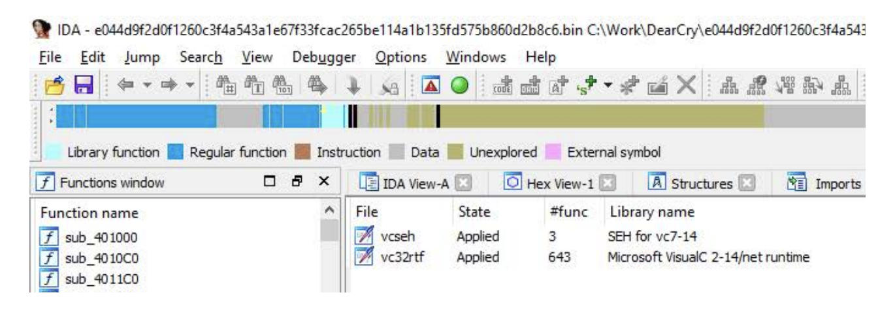

Recall that capa tool identified that this sample is linked against OpenSSL, and there are many strings containing the OpenSSL term. It seems that DearCry is statically linked against OpenSSL version 1.1.


We can obtain the signatures for OpenSSL from the [community driven collection of IDA FLIRT signature files](https://github.com/Maktm/FLIRTDB/tree/master/openssl/windows). They are available for couple of common libraries. We will download and use two which fits most to our case - OpenSSL 1.1 compiled by Visual Studio 2008, as we saw in the extracted strings.

* libcryptoMT\_8\_msvc\_x86.sig
* libcryptoMT\_10\_msvc\_x86.sig

Download them from the link above. Move the downloaded files into the signature folder of your IDA installation. The default path should be `/home/kali/idafree-7.7/sig/pc/`. Then load them into IDA via "File", "Load file" and select "IDA Flirt signature". You will also need to load the `vc32rtf` signature via the same method.

With these two FLIRT signatures applied, we have identified more than 3000 of library functions. Now it seems that only small portion of DearCry functions is custom, developed by authors of the ransomware.


When we examine imports, they are mostly related to cryptography, because of dependencies of embedded OpenSSL library. On the other hand, there is only one exported symbol called start, which is the usual entry point of portable executable files.

### 3.3.2. Ransomware Logic

#### **3.3.2.1. Entry Point**

Now we are ready to begin with analysis of disassembled code. Our objective is to understand what the analyzed program does and how it works.

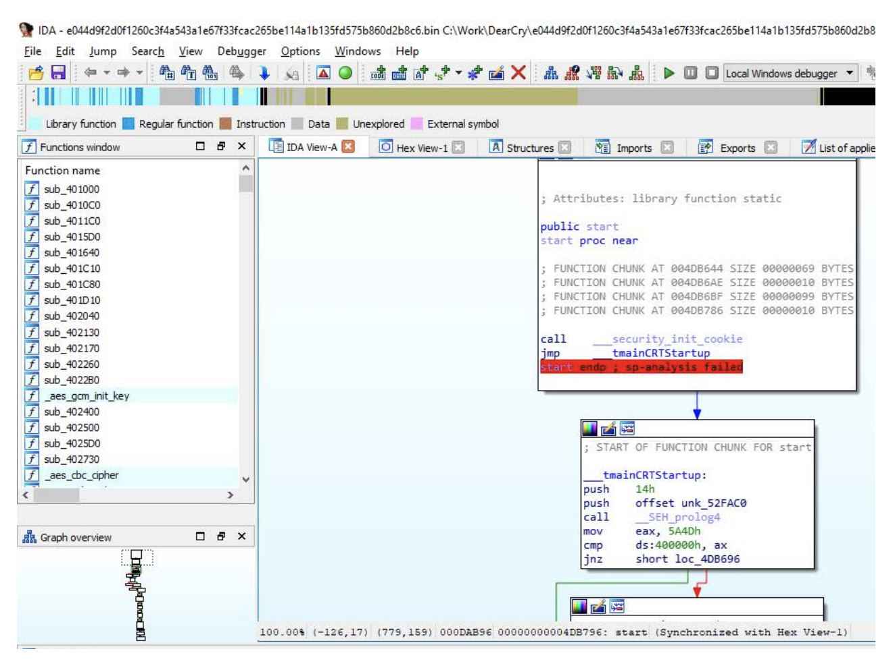

This is more or less the standard start routine, with checking for “MZ” (5A4Dh) and “PE” executable headers, then parsing command line arguments and set environment variables. After that, near to the end of the start routine, there is a call with three arguments. This is the main function of the programs developed in C or C++.


#### **3.3.2.2. Main Function**

The main function is simple. It starts service control dispatcher, which connects the main service thread to the service control manager. The service related to this ransomware is called “msupdate”.


#### **3.3.2.3. ServiceMain Function**

ServiceMain function is also simple, it registers service control handler for this “msupdate” service. And then, it calls yet unknown function sub\_401D10.

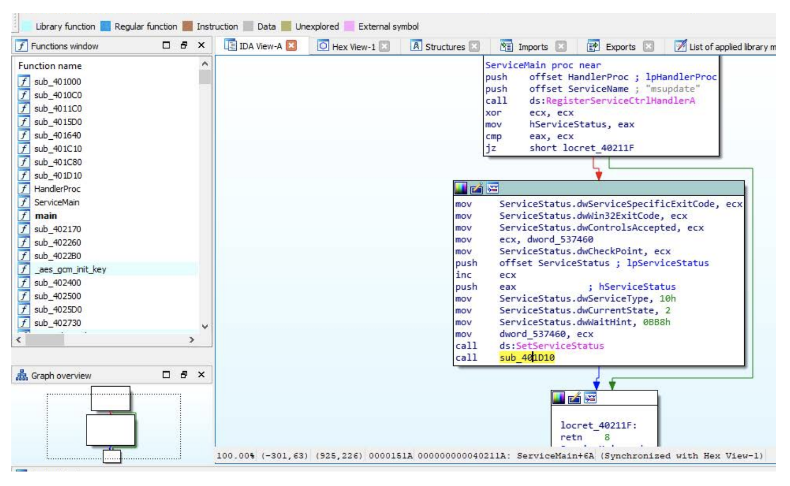

Back in the main function, we can see that the same sub\_401D10 function is called right after the service dispatcher. It seems that this function is responsible for all malicious things performed by this ransomware sample. Hence, it will probably do some ransomware stuff.

#### **3.3.2.4. “Do-ransomware-stuff” Function**


Let's look into the ransomware stuff function. First interesting function is sub\_401000. It references the embedded RSA Public Key and creates string with hexadecimal representation of some values in loop. It actually creates a formatted string with hash value of RSA key.


Next, the ransomware stuff function then prepares a formatted ransom note message and get list of logical drives of the infected machine. It searches for drives with letters between C and Z included, and all types of drive except CD-ROM drive.


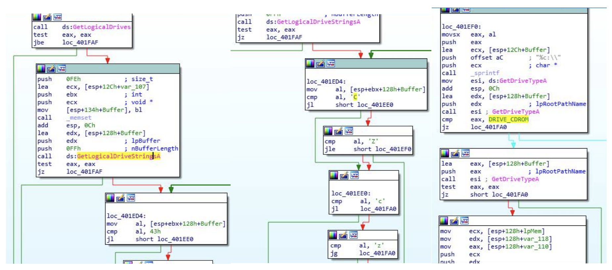

After that, it passes each drive to the function sub\_401640, which will probably be responsible for encrypting drive or folder.

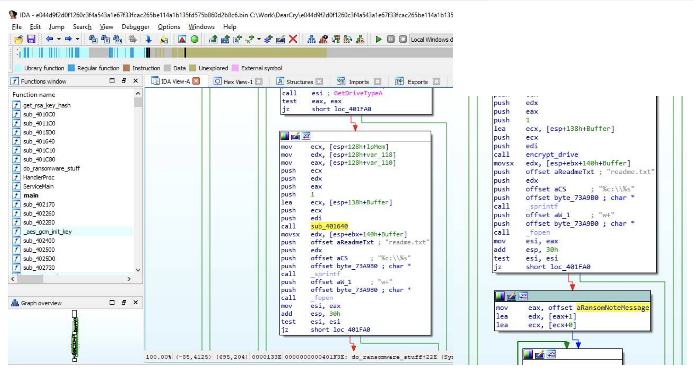

Then, this ransomware stuff function drops `readme.txt` file with the ransom note. And finally, the last call will delete the service “msupdate”, created by this ransomware previously.


### 3.3.3. File Encryption

Until now, we used top-down methodology for analysis of ransomware logic. Now we can change our approach and use bottom-up methodology instead of top-down.

**3.3.3.1. Encrypt-file Function**

During static analysis we saw string “.CRYPT”, which looks like an extension of the files encrypted by this ransomware. Let's examine the cross references to this string in IDA. It is referenced only in one function; thus this function should be responsible for writing an encrypted file to disk.


Let us examine this encrypt file function. Mode “rb+” means that the original file is opened for updating. To be more specific, for reading and writing. The “wb” mode means, that file with “.CRYPT” extension is opened for writing. Hence, DearCry uses copy encryption instead of in-place encryption of files, and it is similar to the infamous WannaCry ransomware.

In Figure 20 we can see that DearCry ransomware prepends a “DEARCRY!” marker to the beginning of the encrypted .CRYPT files.


#### **3.3.3.2. OpenSSL Encryption: RSA+AES**

The ransomware uses OpenSSL for generating a random key for symmetric encryption (AES-256-CBC) and encrypts this symmetric key with RSA using the embedded public key (2048-bit length):

```
-----BEGIN RSA PUBLIC KEY-----
MIIBCAKCAQEA5+mVBe75OvCzCW4oZHl7vqPwV2O4kgzgfp9odcL9LZc8Gy2+NJPD
wrHbttKI3z4Yt3G04lX7bEp1RZjxUYfzX8qvaPC2EBduOjSN1WMSbJJrINs1Izkq
XRrggJhSbp881Jr6NmpE6pns0Vfv//Hk1idHhxsXg6QKtfXlzAnRbgA1WepSDJq5
H08WGFBZrgUVM0zBYI3JJH3b9jIRMVQMJUQ57w3jZpOnpFXSZoUy1YD7Y3Cu+n/Q
6cEft6t29/FQgacXmeA2ajb7ssSbSntBpTpoyGc/kKoaihYPrHtNRhkMcZQayy5a
XTgYtEjhzJAC+esXiTYqklWMXJS1EmUpoQIBAw==
-----END RSA PUBLIC KEY-----
```

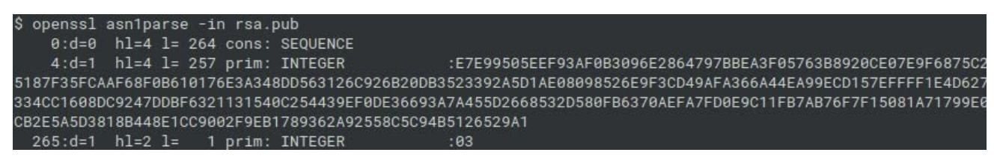

Then, the encrypted symmetric key is written as a part of header of the encrypted file after the “DEARCRY!” marker.

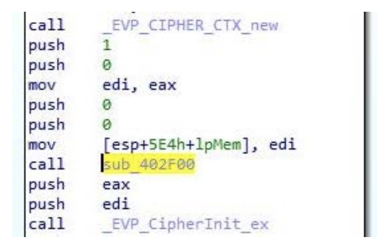

In Figure 22 there are calls to OpenSSL’s functions \_EVP\_CIPHER\_CTX\_new, \_EVP\_CipherInit\_ex and sub\_402F00, which have not been recognized by the used FLIRT signature, but this function should return the type of encryption to be used. Let’s identify this function manually by a quick review of the OpenSSL library and its usage in DearCry ransomware. From the OpenSSL documentation, the first two parameters of EVP\_CipherInit\_ex are context (EVP\_CIPHER\_CTX) and type (EVP\_CIPHER):

```
int EVP_CipherInit_ex(EVP_CIPHER_CTX *ctx, const EVP_CIPHER *type,
ENGINE *impl, const unsigned char *key, const unsigned char *iv, int enc);
```

Example usage of this function could look like this:

```
EVP_CIPHER_CTX ctx;
EVP_CIPHER_CTX_init(&ctx);
EVP_CipherInit_ex(&ctx, EVP_rc4(), NULL, &key, &iv, 1);
```

The EVP\_rc4() function is the example of candidate for the unknown function sub\_402F00. Actually, functions such as EVP\_rc4() are very simple, they contain only couple of instructions which return the object describing the type of the cipher, as is depicted in the Figure 23.


The first value (427) is something called NID, the numbered value of ASN.1 object identifier. The NID value of 427 is associated with the AES-256-CBC cipher.


#### 3.3.4. Put it all together

So, what have we analyzed? It seems that the chain between the start or main function and `encrypt_file` function is almost completely analyzed, except for one function, `sub_4015D0`; see Figure 25.

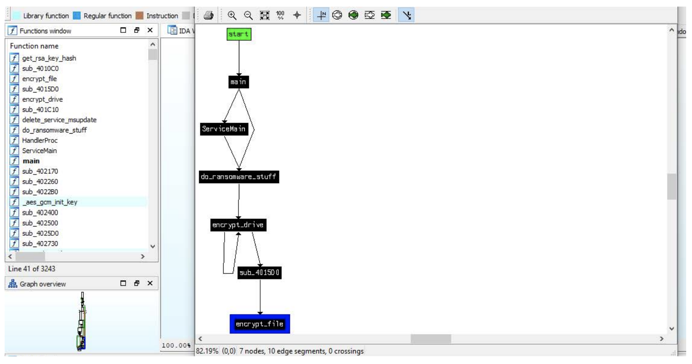

#### **3.3.4.1. Check-marker Function**

Let’s focus on function sub\_4015D0. This time, a file is opened in read mode, and handle to this file is passed to another function, sub\_4010C0. It reads first 8 bytes and compare them with the string DearCry. After that, it performs additional checks. Therefore, it checks header and marker and verifies if file is already encrypted by the ransomware. After these checks by check\_marker function (originally sub\_4010C0), the actual encrypt file function is executed depending on the results of checks.

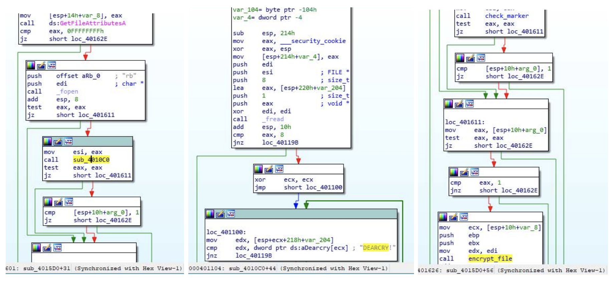

So, we just analyzed another two functions, for checking files and “DEARCRY!” markers before encryption itself. But we also see now, that the encrypt drive/folder function calls itself recursively, and it seems that it will be rather function for encrypting folders instead of drives only.


#### **3.3.4.2. Encrypt-folder Function**

Let's dive into the encrypt\_folder function. It uses Find first file and find next file API calls for searching files in current directory. For files with extension from the aforementioned list of extensions, it calls already analyzed encryption function.

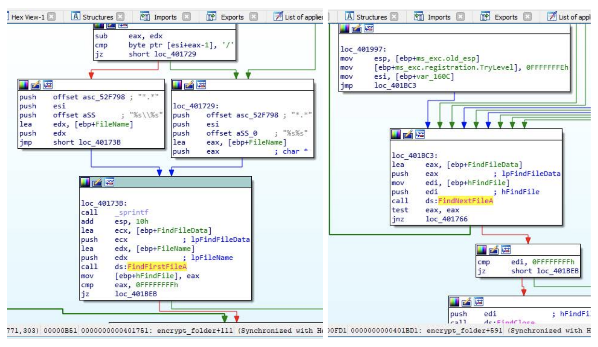

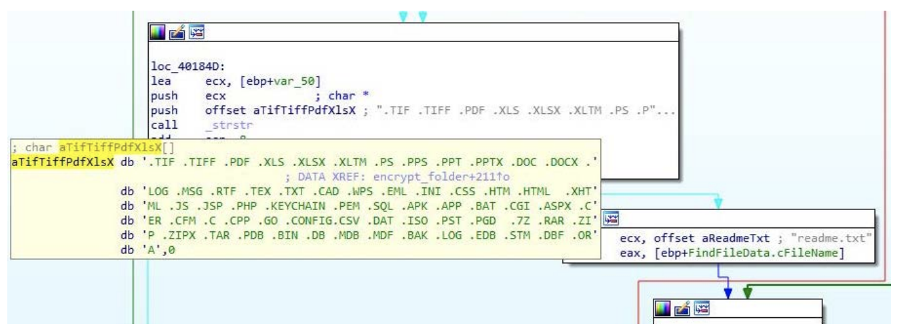

#### **3.3.4.3. ReportServiceStatus Function**

Now there is only one not yet analyzed function, sub\_401C10. Quick look into it reveals that it is kind of report service status for indicating the service state.

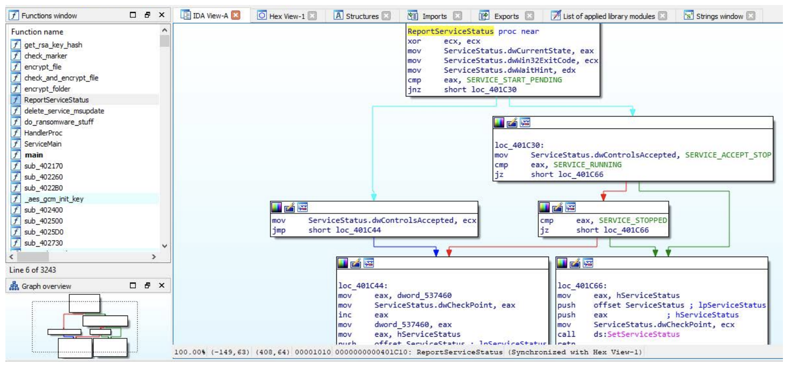

Now we have analyzed every regular function written by authors of the ransomware and we have rather good understanding what this ransomware does and how it works.

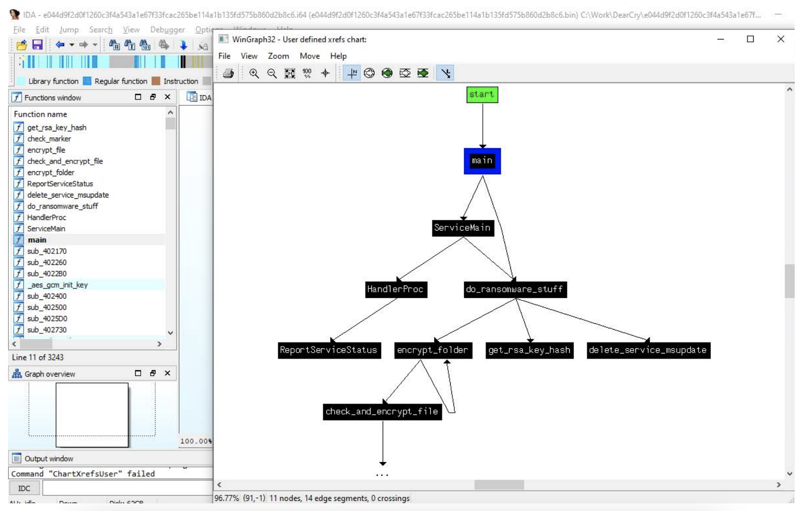

### 3.3.5. Cross-check with behavioural analysis

We can cross-check our results with the results from the behavioral analysis previously performed in sandbox. For example, the encrypted files with the CRYPT extension and DearCry marker in its beginning are clearly visible in the results.


Also, file readme.txt contains the formatted ransom note message including the contact emails and hash of the RSA key.


## 3.4. Conclusion

We introduced several principles of malware analysis and demonstrated them during the analysis of DearCry ransomware sample, which has been used in connection with the recent attacks on vulnerable Microsoft Exchange servers.

During this analysis, we spent most of the time with reverse engineering, including top-down and bottomup methodologies for analysis of unknown programs. As a result, we provided overview of DearCry ransomware’s logic and in-depth analysis of files encryption. We also covered all of the functions written by authors of this ransomware.

Last, but not least, this lab equips somebody interested in, and wanting to do their own analyze of DearCry ransomware. Analyzed samples are available on the Malware Bazaar website and this lab can be used as a walkthrough for educational purposes.

## 3.5. Appendix

### 3.5.1. Sample Information

|             |                                                                                             |
| ----------- | ------------------------------------------------------------------------------------------- |
| File Name   | e044d9f2d0f1260c3f4a543a1e67f33fcac265be114a1b135fd575b860d2b8c6.bin                        |
| File Size   | 1,322,496 bytes                                                                             |
| Mime Type   | application/x-dosexec                                                                       |
| File Type   | PE32 executable (console) Intel 80386, for MS Windows                                       |
| MD5 hash    | cdda3913408c4c46a6c575421485fa5b                                                            |
| SHA1 hash   | 56eec7392297e7301159094d7e461a696fe5b90f                                                    |
| SHA256 hash | e044d9f2d0f1260c3f4a543a1e67f33fcac265be114a1b135fd575b860d2b8c6                            |
| SSDeep hash | 24576:C5Nv2SkWFP/529IC8u2bAs0NIzkQS+KpPbEasBY2iKDl1fpxkLVZgMCS+: oB70s9yjE62iIl1fpxkLVZgMC3 |
| Imphash     | f8b8e20e844ccd50a8eb73c2fca3626d                                                            |

### 3.5.2. List of File Extensions

DearCry ransomware encrypts the files with the following extensions:

```
.TIF .TIFF .PDF .XLS .XLSX .XLTM .PS .PPS .PPT .PPTX .DOC .DOCX .LOG .MSG
.RTF .TEX .TXT .CAD .WPS .EML .INI .CSS .HTM .HTML .XHTML .JS .JSP .PHP
.KEYCHAIN .PEM .SQL .APK .APP .BAT .CGI .ASPX .CER .CFM .C .CPP .GO
.CONFIG.CSV .DAT .ISO .PST .PGD .7Z .RAR .ZIP .ZIPX .TAR .PDB .BIN .DB
.MDB .MDF .BAK .LOG .EDB .STM .DBF .ORA
```

### 3.5.3. RSA Public Key

```
-----BEGIN RSA PUBLIC KEY-----
MIIBCAKCAQEA5+mVBe75OvCzCW4oZHl7vqPwV2O4kgzgfp9odcL9LZc8Gy2+NJPD
wrHbttKI3z4Yt3G04lX7bEp1RZjxUYfzX8qvaPC2EBduOjSN1WMSbJJrINs1Izkq
XRrggJhSbp881Jr6NmpE6pns0Vfv//Hk1idHhxsXg6QKtfXlzAnRbgA1WepSDJq5
H08WGFBZrgUVM0zBYI3JJH3b9jIRMVQMJUQ57w3jZpOnpFXSZoUy1YD7Y3Cu+n/Q
6cEft6t29/FQgacXmeA2ajb7ssSbSntBpTpoyGc/kKoaihYPrHtNRhkMcZQayy5a
XTgYtEjhzJAC+esXiTYqklWMXJS1EmUpoQIBAw==
-----END RSA PUBLIC KEY-----
```

### 3.5.4. Ransomnote

```
Your file has been encrypted!
                                    If you want to decrypt, please contact us.
                                    konedieyp@airmail.cc or uenwonken@memail.com
                                    And please send me the following hash!
                                    d37fc1eabc6783a418d23a8d2ba5db5a
```
