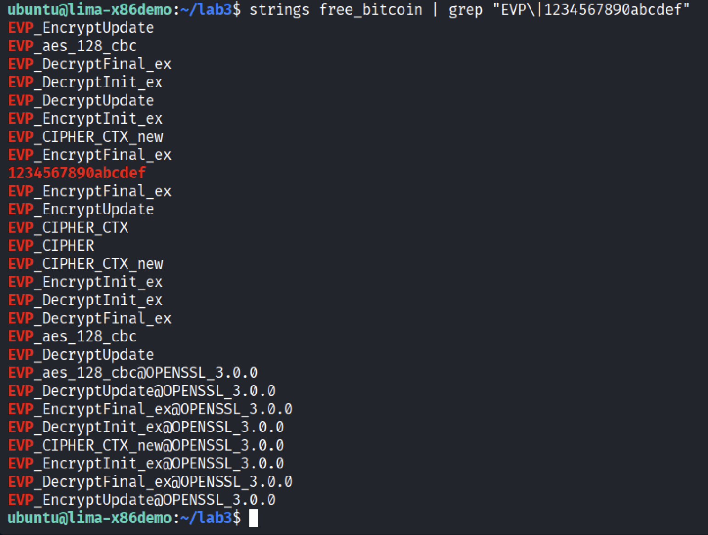
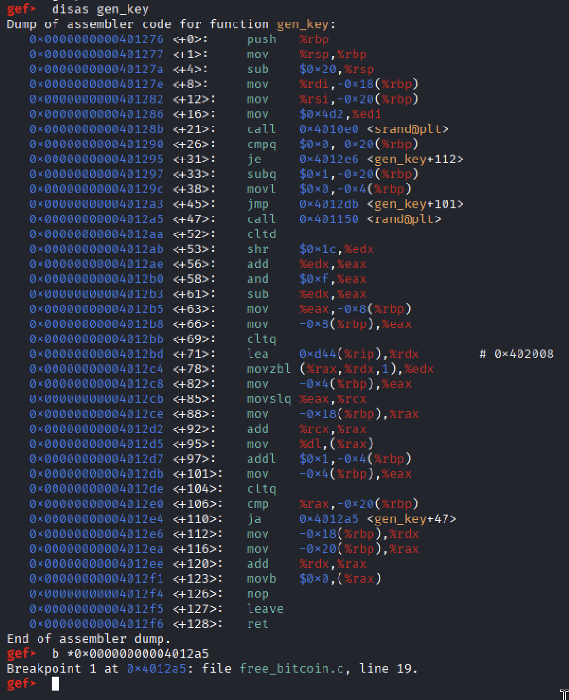
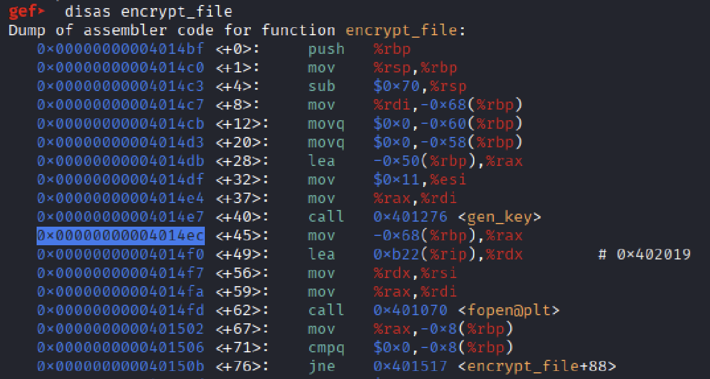
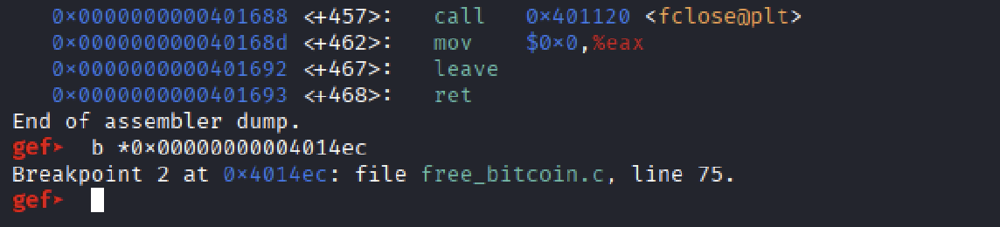
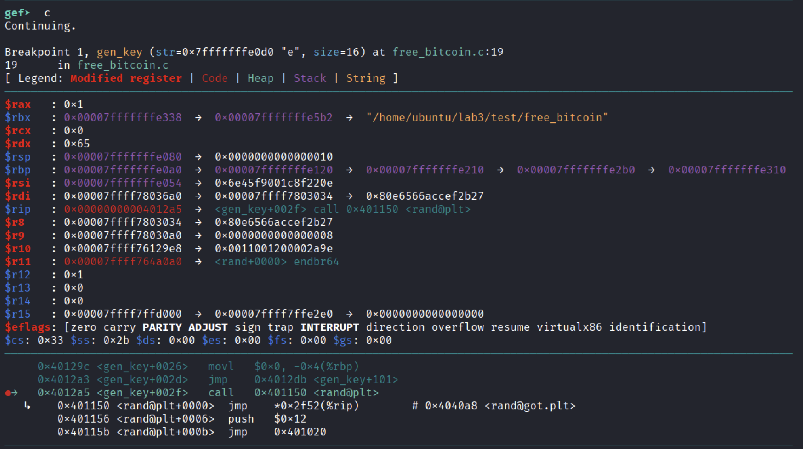
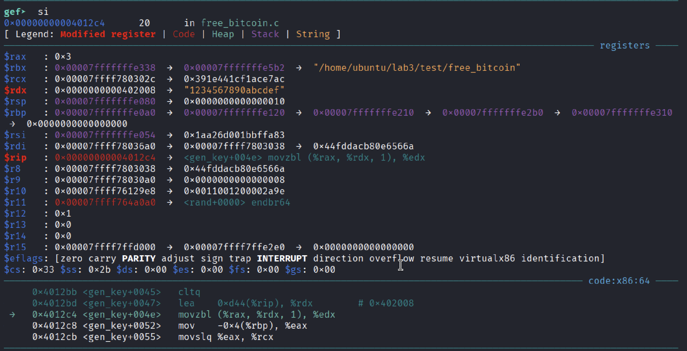
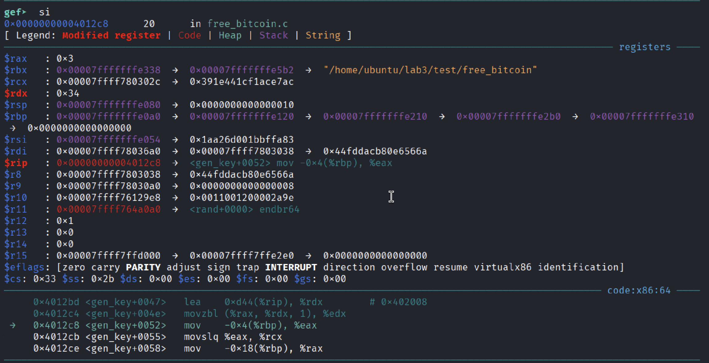

# Lab 3: Reverse Engineering


READ: Any knowledge and techniques presented here are for your learning purposes only. It is **ABSOLUTELY ILLEGAL** to apply the learned knowledge to others without proper consent/permission, and even then, you must check and comply with any regulatory restrictions and laws.


## 3.0. Introduction

Many malware use obfuscation techniques to try to hide the information about how they function. In this lab, we will try to uncover their mechanisms using reverse engineering techniques.

You only need the Kali VM for this lab — except for section 3.1 on Apple Silicon, where you will use the `re_emulation_arm` UTM VM instead (explained at the start of that section).


**Before installing anything in this lab, check whether you already have it.** Kali ships with many of these tools, and the VM provided for this unit has more preinstalled again, so several of the install steps below will be no-ops for you. `apt` is safe to re-run — if a package is already there it simply reports `is already the newest version` and changes nothing — so an unnecessary install costs you nothing but time. That time matters most inside the emulation VM, where everything runs slower.



Later, we will use a tool named Ghidra. It ships with Kali, so check whether you already have it:

which ghidra

If that prints a path, you are set — skip ahead. (If it prints nothing, also just try typing `ghidra`, since some installations live in `/opt` and are not on your `PATH`.) If you really do not have it, install it now in a separate terminal, because it is a large download:

sudo apt-get update -y

sudo apt-get install ghidra -y



**A note on architecture names.** Throughout this lab we say **x86** for the Intel/AMD instruction set, **x86-64** when a binary is specifically 64-bit, and **ARM64** for Apple Silicon machines. Your tools will not be so consistent — the same two things go by many names, and confusing them wastes a lot of time:

| What a tool prints | What it means |
| ------------------ | ------------- |
| `x86_64`, `amd64`, `x64`, `Intel 64` | 64-bit x86 |
| `i386`, `i686`, `IA-32` | 32-bit x86 |
| `aarch64`, `arm64` | 64-bit ARM |

For example, `file` describes a 32-bit binary as "Intel 80386", `uname -m` calls the same machine `i686`, and `apt` calls it `i386`. All three mean 32-bit x86. A binary only runs on the architecture it was built for, which is why this matters.


## 3.1. Reverse Engineering using GDB

GDB, the GNU Project debugger, allows you to see what is going on \`inside' another program while it executes -- or what another program was doing at the moment it crashed. So think of it like a debugger, not for the program you are writing, but for one that has been compiled already. By understanding how they function, it is also possible to reverse the damage caused (e.g., decrypting files that the ransomware encrypted).


We will be using a malware code, so you should only conduct this lab within a VM!


One of the most interesting stories about reverse engineering is the story about the ransomware WannaCry. WannaCry propagated across the internet using the EternalBlue exploit, which was developed by the NSA and leaked by an anonymous hacker group called the Shadow Brokers. It was devastating computers across the world, until Marcus Hitchins reverse engineered the ransomware. Marcus found an unregistered domain within the malware and decided to register the domain. Consequently, he inadvertently found the kill switch for the ransomware, stopping one of the largest cyber-attacks known to this day.

In this section, we will be reverse engineering a newly discovered ransomware called `free_bitcoin`, specifically designed to target x86 machines.


**Apple Silicon (M-series Mac) users:** `free_bitcoin` is an x86-64 binary, so it will not run on your ARM64 Kali VM. Use the **`re_emulation_arm` UTM VM** provided for this unit instead. It runs an emulated x86-64 Ubuntu, so the binary runs normally, GDB behaves exactly as described below, and every address you see will match the screenshots. Log in as `ubuntu` with the password `ubuntu`.

Emulating x86 on an ARM machine is noticeably slower than running natively, so expect the VM to feel sluggish. That is normal, and this section involves very little actual running — almost all of the work is reading.

Do the whole of section 3.1 inside that VM. Section 3.2 (Ghidra) does **not** need it — Ghidra analyses x86 binaries perfectly well on an ARM64 machine, so run that part on your normal Kali VM.

There is a second reason to use a VM here beyond the architecture: `free_bitcoin` is real ransomware and encrypts every file in its working directory. A disposable VM means a mistake costs you nothing.



**Tip: work over SSH if your machine can spare the memory.** Running the emulation VM alongside your Kali VM needs enough RAM for both, but if yours can manage it, connect to the emulation VM over SSH rather than typing into the UTM console window:

```
ip a                 # in the VM console: note the VM's address
ssh ubuntu@<vm-ip>   # from Kali, or from your Mac's own terminal
```

You get proper copy and paste, scrollback and a resizable window, and you can keep your notes and Ghidra on Kali while the ransomware stays confined to the VM. Copy and paste matters more here than it sounds — this section is full of hexadecimal addresses that are easy to mistype.

If the connection is refused, SSH may not be running in the VM; start it with `sudo systemctl enable --now ssh`. The UTM console works perfectly well either way, it is just less comfortable.


```
wget https://github.com/uwacyber/cits3006/raw/live/cits3006-labs/files/free_bitcoin
```

It was reported that a victim tried to get free bitcoin by running the program, but instead encrypted everything in the working directory. We will try and reverse engineer the malware to retrieve the encryption key used to encrypt the victim’s files.

For this task, we will use a light-weight tools namely GDB to reverse engineer the ransomware, but we will first use other simple tools (`strings` and `objdump`) to discover more about the ransomware at hand.

### 3.1.1. Using strings command

We will begin our analysis of the ransomware by running the `strings` command on the binary. Below is a picture of the output of strings being piped into grep to highlight some key library functions and hardcoded strings that were found inside the ransomware.

```
strings free_bitcoin | grep "EVP\|1234567890abcdef"
```



The above screenshot shows that the malware uses the OpenSSL Crypto library. The ransomware is also using the AES 128-bit encryption with the CBC mode, which means that the key used to encrypt the files is 128 bits (16 bytes) long.

The other interesting detail is the string “1234567890abcdef” inside the program, which could be the key since it is 16 bytes long, or the key could be generated using this string in some way, or it is just there to throw off our investigation. We will just take a note of it for now.

Next, we will collect more info using `objdump`.

### 3.1.2. Using objdump

This is where we start looking at the assembly code of the ransomware. Run:

```
objdump -d free_bitcoin
```


If you are following section 3.1 inside the `re_emulation_arm` VM as described above, plain `objdump` works and your output will match the screenshots exactly.


Ignoring the included functions from libraries, we find that the malware has the functions `main`, `encrypt_file`, `decrypt_file` and `gen_key`. Let us take a closer look at the `gen_key` function since this is most likely where the key is created to be used for encryption. Below is the assembly code of this function.

.png>)

Of interest is that the function calls `srand` (at line 7, address `40128b`), which is the C function for setting the seed for the random number generator. To try and figure out what is the value of the seed, we will compile our own test program and compare the assembly code. We have provided you with the test code `srand_test.c`.

```
wget https://github.com/uwacyber/cits3006/raw/live/cits3006-labs/files/srand_test.c
gcc -o srand_test srand_test.c
```

The test code uses the value of 16 (0x10 in hexadecimal) to set the seed, so we will look for where this value is in the assembly code.

.png>)

When you run `objdump` on the compiled file, you should see the main function as:

 (1) (2).png>)

We can see that our seed value of `0x10` is moved into the `edi` register directly before the program calls `srand` — on 64-bit x86, the first argument to a function is passed in `edi`/`rdi` rather than being pushed onto the stack. Comparing this procedure to the assembly code from above, we can see the same pattern in `gen_key`: at address `401286` the hexadecimal value `0x4d2` is moved into `edi`, and the `srand` call follows at `40128b`. This means that in `gen_key`, the seed is set to `1234` (i.e., 0x4d2 in decimal format).

Now we are ready to debug our ransomware.

### 3.1.3. Using GDB with GEF

`GDB`, as described above, is a debugging tool. However, its interface is quite difficult to use without spending time learning more about it. To make your life (slightly) less miserable, we will also use `GEF` (GDB Enhanced Features), which displays the registers and the surrounding code automatically every time the program stops.


**Using the provided emulation VM?** GDB and GEF are already installed and configured there — skip both installs below and carry straight on to the command list.


First, install GDB:

```
sudo apt-get update -y
sudo apt-get install gdb -y
```

Next, install `GEF`:

```
sudo apt install gef -y
```

Once it is installed, start the debugger with `gef`. If your system has no `gef` command, use `gdb` instead — on some installations GEF is loaded into `gdb` automatically. Either way you should get a `gef➤` prompt rather than the usual `(gdb)` one, and that prompt is how you know GEF is running.


**If you installed GEF yourself, your display may not look exactly like the screenshots below.** The VM has a couple of settings changed so that the output fits on one screen. None of this changes the *information* GEF gives you — only how much of it is shown at once — but if you would like your terminal to match the screenshots, run these at the `gef➤` prompt:

```
gef config context.clear_screen 0
gef config context.layout "legend regs code"
gef config context.nb_lines_code 3
gef config context.nb_lines_code_prev 2
gef save
```

`gef save` writes them to `~/.gef.rc` so they persist, and deleting that file restores GEF's defaults.

The setting worth understanding is `context.clear_screen 0`, which stops GEF from wiping your scrollback every time the program stops. You will be stepping with `si` repeatedly and comparing each state to the one before it, so keeping that history is genuinely useful.


Below we list some useful commands to use inside GEF to help you reverse engineer the ransomware.

- `gef➤ info func` : Prints out all the functions inside of the program.
- `gef➤ disas <function name>` : Print the assembly code and machine instruction number of a function.
- `gef➤ b *<machine instruction address>` : Pauses the program's execution at the machine instruction address and prints the program's state.
- `gef➤ x/2x $rsp` **:** Prints the first 2\*4=8 bytes from the start of the stack (`$rsp`; on 32-bit binaries the stack pointer is called `$esp` instead)
- `gef➤ r` : Starts the program's execution from the very start.
- `gef➤ c` **:** Continue the program's execution to the next breakpoint or until completion.
- `gef➤ si` : Execute the next machine instruction and then print the state of the program.

For a list of more commands to use gdb, take a look at [https://darkdust.net/files/GDB%20Cheat%20Sheet.pdf](https://darkdust.net/files/GDB%20Cheat%20Sheet.pdf).

Since the ransomware is poorly designed and only encrypts the files in the working directory, we will create a test folder to execute the malware from. Ideally, if you are doing real malware analysis you would want to completely isolate it inside a separate VM before executing it. However, for our purposes running it from inside an isolated directory should be sufficient since it only encrypts files inside the working directory.

You can use the commands below to prepare your test folder and start the debugger.

```
mkdir test
cp free_bitcoin test/
cd test/
chmod 500 free_bitcoin
gdb free_bitcoin      # or: gef free_bitcoin
```


Apple Silicon users: run this inside the `re_emulation_arm` VM (see the note at the start of section 3.1). Everything below then works exactly as written, with the same addresses and registers shown in the screenshots.



If the ransomware refuses to start with `error while loading shared libraries: libcrypto.so.3`, you are missing the OpenSSL 3 runtime — install `libssl3` on Kali, or `libssl3t64` on Ubuntu. You can always ask which shared libraries a binary needs with `ldd free_bitcoin`, which is a handy first move when any unfamiliar binary refuses to run.


We will begin our analysis by getting the machine instruction for when the function `rand` is called and set a breakpoint at that instruction so we can analyse the state of the program. We will also set another breakpoint directly after `gen_key` returns to the function `encrypt_file`, so that we can pause the program's execution before any files are encrypted. Below are the commands with snippets to help you set up the breakpoints before starting the program.







We will start running the program to see the state of the registers each time the `rand` function is called. Run the program by entering `r`, then continue running it by entering `c` once.



The screenshot above shows the state of the program after reaching the `rand` function a second time (continuing the execution of the program once). This snapshot of the program’s state tells us two important things about how the key is generated.

- Firstly, the key is generated inside a loop since when the program continued after reaching the first breakpoint it paused at the same breakpoint a second time, instead of reaching the breakpoint in `encrypt_file`.
- The second observation is that the `RDX` register holds `0x65`, which is the ASCII code for the character `e`. You can see the same thing spelled out in the breakpoint line just above the registers, which reads `gen_key (str=... "e", size=16)` — the buffer the key is being built in already contains `e`. So `e` is the result of some operations following the first `rand` call, and is possibly (and most likely) the first character of the encryption key.

To investigate this further, we will now set a breakpoint just after the `rand` call, at the machine instruction at address `0x4012aa`, and step through the program one machine instruction at a time until we find something interesting. Set the breakpoint with `b *0x4012aa`, reach it with `c`, and then step with `si` repeatedly. At every step, inspect what GEF prints — the registers in particular — to see if you can find anything useful. Once you reach the instruction `movzbl` (about nine steps later, at `0x4012c4`), you will see the state below.


If you would also like GEF to show the stack, add it to the layout with `gef config context.layout "legend regs stack code"`. It is not needed for this walkthrough, so the screenshots here do not show it.




The instruction just executed (`lea`) loaded the address `0x402008` into `RDX`, and GEF helpfully shows what lives at that address: the familiar string `"1234567890abcdef"` we found earlier with `strings`. The `movzbl` about to run will pull a **single byte** out of that string, at the offset held in `RAX` — which is `3`. Counting from zero, character 3 of `1234567890abcdef` is `4`, so we can predict what will happen before it does. Step in with `si`, and indeed the letter `4` is now loaded into `EDX` (`RDX` shows `0x34`, the ASCII code for `4`).



So definitely, the string "`1234567890abcdef`" is used to generate the key string!

Based on our findings, we can conclude that:

1. The ransomware sets the random seed to be `1234`.
2. The `rand` generator is used to select a char from a string "`1234567890abcdef`".
3. Step 2 is repeated until the key size is 16 bytes (i.e., looped 16 times).
4. Using the generated key from step 3, aes-128-cbc is used to encrypt files.

You can now either (1) continue debugging the ransomware to find the key (keep running until you generate the first 16 bytes of the key), or (2) write a code that mimics the key generation steps described above (i.e., set the seed to `1234` and choose char from "`1234567890abcdef`". The first output is "`e`", followed by "4" and so on). Either way, you should converge to the same key.

## 3.2. Another tool: Ghidra

Ghidra is a tool for reverse engineering, which has been used for many years by special services. Now it is available to everyone.

Ghidra should be ready by now — either it came with your Kali image, or you installed it at the start of the lab. Since the required JDK is already installed on Kali, your Ghidra should be good to go (if using another OS VM, install the necessary requirements yourself).

Once you run ghidra (just type `ghidra` from the terminal), you will first be greeted with the agreement notice - press "agree". Then, you see the Ghidra Help - you can read this at your own time to get more familiar with Ghidra, but otherwise you can close it for now. Finally, you will see the main ghidra window and the tip window (close this also). Now we are ready to get started!

### 3.2.1. Opening a project in Ghidra

Download the files we will be using for this section.




```
wget https://github.com/uwacyber/cits3006/raw/live/cits3006-labs/files/crackme-linux.zip
```




```
wget https://github.com/uwacyber/cits3006/raw/live/cits3006-labs/files/crackme-source.zip
```

Once downloaded, compile codes using the makefile provided.




**Everyone downloads the same `crackme-linux.zip`, including Apple Silicon users.** Ghidra analyses a binary without running it, and it does that identically no matter what architecture your own machine is — so your output will match the screenshots exactly. For the Ghidra work in section 3.2 you do not need the emulation VM; your normal Kali VM is fine.

Finding the passwords is done by *reading* the binary in Ghidra, which works on any machine. But you will want to **run** each crackme to confirm the password you recovered is correct — and for that the architecture does matter. Apple Silicon users: run them inside the `re_emulation_arm` VM.



These crackmes are **32-bit x86** binaries, so you need the 32-bit runtime libraries before they will start — on Kali *or* in the VM. You may well have them already, in which case `apt` will simply tell you so:

```
sudo dpkg --add-architecture i386
sudo apt update
sudo apt install libc6:i386
```

Without them the binary fails with `No such file or directory`, even though the file is plainly there. That message refers to the missing 32-bit program loader (`/lib/ld-linux.so.2`), not to the crackme itself — a confusing error worth recognising.


On Ghidra, create a new project (doesn't matter shared or not). You can name it `crackme0`.

Next, import `crackme0x00` from the unzipped folder to Ghidra, you can either drag and drop, or import file from the menu. You can leave the other settings unchanged, and finish importing the file.

 (1) (4).png>)

Open the analyser by double-clicking the binary. You will be prompted with the analyser, which you simply press "yes" (the pre-selected analysers are sufficient here). Then it will get you here:

 (1) (3).png>)

On the CodeBrowser console, you see a few windows:

- **Program Trees**: This window displays the code sections of the binary.
- **Symbol Tree**: This window displays the import, export, functions, labels, classes and namespaces of the binary.
- **Data Type Manager**: This window displays all specific types, including built-in ones, specific for the binary file and other types included in Ghidra.
- **Listing**: This window displays the reverse-engineered code.
- **Decompiler**: This window displays the high-level code generated by Ghidra from the assembly code shown in the Listing window. To see, scroll down in the Listing window, and select some functions to see their code representations.

Now we will inspect our binary file. The behaviour we observed was that it prompts for the password, checks the password, and then responds based on the user input provided.

 (2).png>)

### 3.2.2. `crackme0x00` walkthrough using Ghidra

Let's start by inspecting the program strings: Window -> Defined Strings.

 (3).png>)

 (2).png>)

Well, it seems the password was stored in cleartext in the binary as shown above. Nevertheless, we will still have a look at whether this password indeed is the one that works with the binary. Double-click the `Password` entry in the `Defined Strings` window, which will take you to the section where the string is stored.

 (1).png>)

You will see that it is referencing something in the main function (the green text on the RHS). So let's follow by double-clicking the address, which takes you here:

 (1) (5).png>)

You will see that there is a `scanf` call after the reference to the `Password`, and then followed by the `strcmp`. This looks pretty much like where the password was prompted when the binary was run, and how the password is checked! Having a look at the decompiled code makes this suspicion a reality:

 (1).png>)

The entered password is read into a local stack buffer, and the value `250382` is the string it is compared against — it appears as the other argument to `strcmp` (check the assembly code alongside the decompiled view). The result from `strcmp` is then checked, with zero meaning the two strings are identical. Hence, the string `250382` is our password!


Ghidra invents names like `local_1c` for variables it cannot recover a real name for, and **those names change between Ghidra versions**. Yours may not match the screenshot. Read the structure — which value goes into `strcmp`, and what the return value is compared to — rather than matching names against the image.


 (3).png>)

### 3.2.3. Solve `crackme0x01` and `crackme0x02` using Ghidra

Try the next two binaries `crackme0x01` and `crackme0x02` yourself and see if you can crack the password!

### 3.2.4. `crackme0x03` walkthrough using Ghidra

We start off similar to the previous questions, but obviously, this won't have the password saved the same as before. When we inspect the strings, we can still see the word "Password" as the prompt, so it is a good place to start. Inspecting the code where the password in entered first:

.png>)

The main function can be inspected from here, and indeed the way the password check is done is different. Instead of checking the password in the main, it calls another function `test`, with two variables passed in.


But at this point, you probably guessed that the second arg 0x52b24 is probably the password we are looking for. If you try that as is, it will fail because of course the representation is in hex. You have to convert it to decimal first, and this is already done for you - right-click on the variable and it will show you other commonly used conversion values. The decimal value 338724 seems like a good candidate, so try that as a password.

.png>)

Indeed, that was the password!

 (4).png>)

Anyway, let's inspect the function test to see whether this is indeed the place where the password is checked or not. From the decompiler window, double-click the function name `test`.

 (1) (2).png>)

Decompiling the test function, it is showing some shift functions, which aren't conventional c functions so it must be doing something, possibly shifting. So let us try shifting the letters.

 (1).png>)

Function called `shift` is being used, this isn't any built-in function so is a custom, and is probably doing some shifting. Double-click the shift function to see what it does.

 (1).png>)

If you read the function carefully, the operation is quite simple. To make the readability better, let's rename some variables (you can press "`L`", or right-click to see the option):

- `local_80` -> `i`
- `local_7c` -> `output`
- `sVar1` -> `str_len`

Then we have:

.png>)

So basically the loop goes over each char from the input arg `param_1`, and shift it by -0x3 (remember, we are working in hex). We can shift from terminal using Python:

.png>)

Indeed, those were the messages displayed when guessing the password!

There are more `crackme` puzzles provided in the zip, so have a go at them at your own speed :)

## 3.3. Conclusion

We learned additional tools to help us reverse engineer binary files and inspect their functions to gather important information about their operations. This is especially useful for dissecting binaries such as malware, where you can also be able to reverse the damage caused. For example, the WannaCry ransomware was shut down by reverse engineering the malware binary and finding out its terminating condition.

Next up, privilege escalation.

Credit: some materials were adopted from the IOLI workshop with minor edits/updates.
