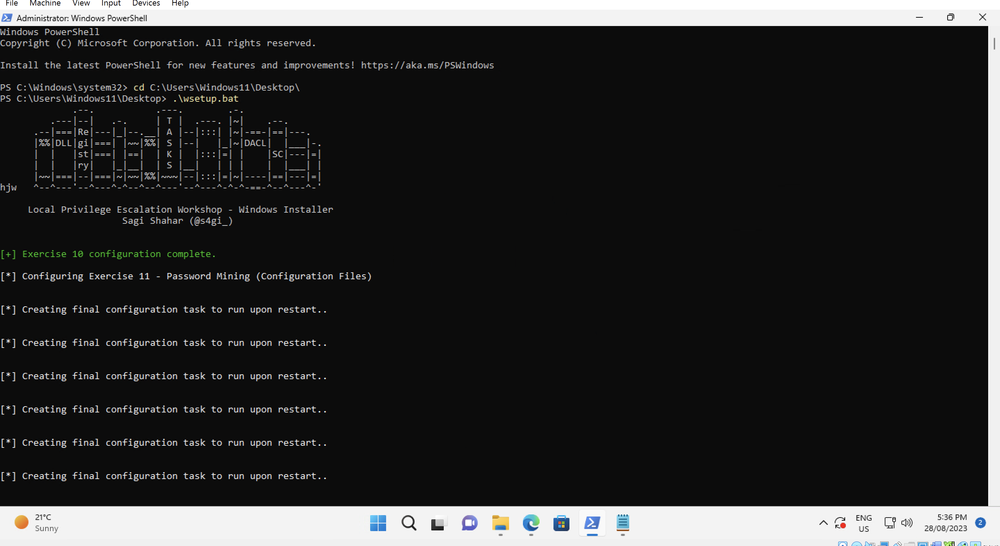
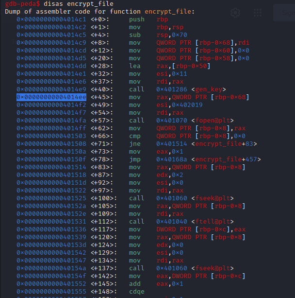

# Lab 4: Privilege Escalation


READ: Any knowledge and techniques presented here are for your learning purposes only. It is **ABSOLUTELY ILLEGAL** to apply the learned knowledge to others without proper consent/permission, and even then, you must check and comply with any regulatory restrictions and laws.


## 4.1 Introduction

You will need your Kali VM, Windows VM, and the DebLinux VM.&#x20;

* A copy of the DebLinux image can be found from the Teams -> Labs -> Files, in two formats: **`DebLinux.utm`** for UTM (use this one on an Apple Silicon Mac) and `DebLinux.ova` for VirtualBox. Some account details are below:&#x20;
  * non-admin user: `user`:`password321`&#x20;
  * admin user: `root`:`password123`


**Apple Silicon (M-series Mac) users:** you do not need to convert anything. The shared VM folder already contains UTM versions of every machine used in this unit — `DebLinux.utm`, `Metasploitable.utm`, `Windows 7.utm`, `Windows11.utm` and `WindowsServer2019.utm` — so download the `.utm` image rather than the `.ova`. The x86 ones run under emulation, which is slower than native but perfectly workable for this lab.



Some ISOs/VM images are available from MS Teams — click <a href="https://uniwa.sharepoint.com/:f:/r/teams/CITS3006SEM-22026/Shared%20Documents/Labs?csf=1&#x26;web=1&#x26;e=ZRuPlW">here</a>.


### 4.1.1 Windows VM Setup

If you haven't done already, set up a Windows VM as described in [Lab 2](https://uwacyber.gitbook.io/cits3006/cits3006-labs/lab-2-malware#id-2.0.-setup-windows-vm). Windows 11 is what these exercises were tested on; if you run into trouble, the Windows 7 image in the shared VM folder also works. Once you have created an admin account and are now able to access the desktop, complete the following steps:


Make sure Windows Defender is still turned off before you go any further — the same [steps from Lab 2](https://uwacyber.gitbook.io/cits3006/cits3006-labs/lab-2-malware#id-2.0.-setup-windows-vm) apply here. The setup script writes several service executables to disk, and in 4.2.2 you will build a payload with `msfvenom` that Defender will certainly quarantine. If files start disappearing partway through an exercise, this is almost always why.


1. Log in to the Windows VM using a user account that has administrator privileges.
2. Ensure the Windows VM does not have a user account named 'hank'. If it exists, you can either delete it, or replace 'hank' below with your chosen username, and also replace it in the script in step 3 below.
3.  Download the setup script on the Windows VM (the Desktop directory is fine).&#x20;

    ```powershell
    Invoke-WebRequest -Uri "https://github.com/uwacyber/cits3006/raw/live/cits3006-labs/files/wsetup.bat" -OutFile "wsetup.bat"
    ```
4. Right-click on the copied setup file and ensure to select from the pop-up menu 'run as Administrator'. This will set up the Windows system for the subsequent exercises.
5. Take note of the resulting output. One of the executed tasks is to create a new user account `hank` with password `password321`.

<figure><figcaption></figcaption></figure>

Restart the Windows VM and log in to `hank`.



If you encounter an issue where the wsetup.bat script does not attempt the configuration of Exercises 1-9, and then loops the output “[\*] Creating final configuration task to run upon restart..”, as shown in the image below, then you can fix this by copy and pasting the wsetup.bat contents into your own separate file and executing this instead. This resolves an issue where Unix LF line endings are used instead of Windows CRLF line endings.

PowerShell fix if needed: re-download via IWR and normalise CRLF
  ```powershell
  Invoke-WebRequest -Uri "https://github.com/uwacyber/cits3006/raw/live/cits3006-labs/files/wsetup.bat" -OutFile wsetup.bat
  (Get-Content wsetup.bat -Raw) -replace "`n","`r`n" | Set-Content wsetup.bat -NoNewline
  ```

<figure><figcaption></figcaption></figure>



## 4.2 Windows Privilege Escalation

### 4.2.1 Insecure Service Permissions

Each service has an Access Control List (ACL) that specifies specific permissions to a certain service.

The permissions a user holds over a service determine what they can do to it:

* query the configuration of the service: `sc qc <service>`
* check the current status of the service: `sc query <service>`
* start and stop the service: `net start <service>` and `net stop <service>`
* change the configuration of the service: `sc config <service> <option>= <value>`

The first two are read-only, and useful for reconnaissance. The last one is the dangerous one, because it lets the caller rewrite the executable that the service runs.


you might need to type `sc.exe` instead of just `sc`. `sc` stands for Service Control, which is a command that you can use to interact with Windows Services.


If a user has permission to change the configuration of a service that runs with SYSTEM privileges, we can change the executable the service uses to one of our own, including a reverse shell. Let's discover the running services with any service enumeration tool, such as [winPEAS](https://github.com/carlospolop/PEASS-ng/tree/master/winPEAS) or by typing `Get-Service`. (winPEAS and its Linux counterpart linPEAS are packaged on Kali as `peass-ng`, so `sudo apt install peass-ng` saves you fetching them from GitHub each time. linPEAS will be useful for section 4.3.) You will find an exhaustive list of services, one of which is the `daclsvc` service.

<figure><figcaption></figcaption></figure>

We'll need a tool named `AccessChk`, which you can download from the official Microsoft site:

```
https://learn.microsoft.com/en-us/sysinternals/downloads/accesschk
```

Or a copy from our github repo:

```powershell
Invoke-WebRequest -Uri "https://github.com/uwacyber/cits3006/raw/live/cits3006-labs/files/AccessChk.zip" -OutFile "accesschk.zip"
```

Once downloaded, extract the files.


The archive contains three binaries: `accesschk.exe` (32-bit), `accesschk64.exe` (x64) and `accesschk64a.exe` (ARM64). If you are running an ARM64 Windows image under UTM on an Apple Silicon Mac, use `accesschk64a.exe` and substitute that name wherever `accesschk64.exe` appears below.


The tool `AccessChk` is used to check the permissions of user accounts, which is good for administrative tasks, but also could leak useful information for adversaries.

Using the `accesschk.exe` tool, you can look at which services the user `hank` has permissions over (read the documentation to understand the meaning of flags):

```powershell
.\accesschk64.exe -accepteula -uwcqv "hank" *
```


The `-accepteula` flag accepts the Sysinternals licence agreement on the command line. Without it, the first run pops up a dialog box and waits, which is easy to miss if you are working from a shell.


<figure><figcaption></figcaption></figure>

We've confirmed that `hank` has RW (read-write) permissions over the `daclsvc` service. This is the only service `hank` is able to *reconfigure*, which is why the `-w` (write access) filter narrows the list down to this one alone — `hank` can start and stop several other services, but those rights on their own are not enough to escalate. The listing includes the `SERVICE_CHANGE_CONFIG` permission, which grants the caller the right to change the executable file that the system runs. Thus, this permission should be granted only to administrators. What we can do now is elevate the permissions of this user to the administrator through this misconfigured service. We first check our current group membership for `hank`:

<figure><figcaption></figcaption></figure>

We first have to stop the service we wish to modify:

```powershell
net stop daclsvc
```

Now we execute the command to add `hank` to the administrators group:

```powershell
sc.exe config daclsvc binPath= "C:\Windows\System32\cmd.exe /c net localgroup administrators hank /add"
```


Note the space after `binPath=`, and use a fully qualified executable path (e.g., `C:\Windows\System32\cmd.exe /c …`) to avoid “System error 2 (The system cannot find the file specified)”.


<figure><figcaption></figcaption></figure>

Now restart the service and check whether `hank` has been added to the administrators group or not.

<figure><figcaption></figcaption></figure>


`net user hank` will show the new group membership straight away, but the session you are already logged into will not have the new privileges. Windows builds an access token when you log on and does not rebuild it when your group membership changes afterwards. Sign out and back in as `hank` before trying anything that actually requires administrator rights, and note that this is a general property of Windows privilege escalation, not a quirk of this exercise.


Using the command `sc qc daclsvc`, we can also see the binary path that we have altered for the `daclsvc` service. Note the BINARY\_PATH\_NAME variable.

<figure><figcaption></figcaption></figure>


With this service's misconfigured permissions, we can actually modify the binary path to contain whatever commands we want, such as the running of a reverse shell. You simply change the `binPath=` to be the path to a reverse shell executable, then the reverse shell will start whenever the service is called. You can manually start the service with `net start daclsvc`. Try this out as an exercise!


In an admin cmd, run the command `net localgroup administrators hank /delete` to remove the user from the administrators list as a preparation for the next exercises.

### 4.2.2 Unquoted Service Path

Services whose executable path contains spaces and isn't enclosed within quotes can lead to a privilege escalation. When a service is created whose executable path contains spaces and isn’t enclosed within quotes, this leads to a vulnerability known as _Unquoted Service Path_ which allows a user to gain SYSTEM privileges (only if the vulnerable service is running with SYSTEM privilege level, which most of the time it is). if the service is not enclosed within quotes and is having spaces, it would handle the space as a break and pass the rest of the service path as an argument. This can be exploited to execute an arbitrary binary when the vulnerable service starts, which could allow escalating privileges to SYSTEM.

For this exercise, there will be a vulnerable service called `unquotedsvc` in your system. Inspect its configuration with `sc.exe qc unquotedsvc`.

<figure><figcaption></figcaption></figure>

We see that the binary path is missing the quotations around it. The configured path is:

```
C:\Program Files\Unquoted Path Service\Common Files\unquotedpathservice.exe
```

Without quotes, the Service Control Manager cannot tell where the executable name ends and its arguments begin, so it treats each space as a possible break and tries the candidates in turn, left to right, until one of them exists:

```
C:\Program.exe
C:\Program Files\Unquoted.exe
C:\Program Files\Unquoted Path.exe
C:\Program Files\Unquoted Path Service\Common.exe
C:\Program Files\Unquoted Path Service\Common Files\unquotedpathservice.exe
```

Normally the first four do not exist, so the search falls through to the last one and the real service starts. But if we can write into any of the directories along that path, we can plant a file at one of the earlier candidates and the SCM will launch it instead — with the service's privileges, which here are SYSTEM. `C:\Program Files\Unquoted Path Service` is writable by us, so our target is the fourth candidate: `C:\Program Files\Unquoted Path Service\Common.exe`.

We are going to create a malicious executable that takes advantage of this vulnerability. This executable will perform a similar task to 4.2.1; it will grant the user administrator permissions. We will create this .exe in Kali with the command:

```bash
msfvenom -p windows/exec CMD='net localgroup administrators hank /add' -f exe-service -o common.exe
```

<figure><figcaption></figcaption></figure>

This is a Metasploit payload, so Defender will quarantine it on sight if it has crept back on. If the file vanishes after you copy it across, revisit the Lab 2 steps referenced in 4.1.1.

The filename here is not a free choice: it has to match the candidate the SCM will look for, `Common.exe`. (Windows filenames are case-insensitive, so `common.exe` matches.) Copy this .exe over to the Windows VM and place it in the `C:\Program Files\Unquoted Path Service` directory — directly in that folder, **not** inside `Common Files`. In cmd, restart the service by running `net stop unquotedsvc` and then `net start unquotedsvc`.


<figure><figcaption></figcaption></figure>

Once again, confirm that this user's permissions have been elevated via `net localgroup administrators`. You should see `hank` in the administrators list. Of course, you could plant any .exe you wanted, including reverse shells, etc.

As in 4.2.1, tidy up before moving on: run `net localgroup administrators hank /delete` from an admin cmd, and delete `C:\Program Files\Unquoted Path Service\Common.exe` so that the service starts its real binary again.

### 4.2.3 Password Mining (Registry)

Password mining refers to the process of searching for and enumerating encrypted or clear-text passwords stored in persistent or volatile memory on the target system. In this exercise, we'll try to discover passwords stored in registry keys that may or may not be encrypted. One of these credential sets may have elevated permissions...

One place we can check is the automatic login credentials. Windows allows a user to automate the logging-in process by storing passwords and other pertinent information in the registry database. Locate the default credentials using these commands in cmd:

```powershell
reg query "HKLM\SOFTWARE\Microsoft\Windows NT\CurrentVersion\Winlogon" /v DefaultUsername
reg query "HKLM\SOFTWARE\Microsoft\Windows NT\CurrentVersion\Winlogon" /v DefaultPassword
```

<figure><figcaption></figcaption></figure>

We see the credentials of our user with non-administrator permissions in plaintext.&#x20;

### 4.2.4 Password Mining (VNC)

If there are other services running (e.g., PuTTY, TightVNC, etc.), you could also check the registry entries to see if there are any credentials. VNC servers are a good example: they store the connection password in the registry, and they store it **encrypted rather than hashed**.

For example, recover the plaintext of these two values, taken from a TightVNC server's registry entries:

```
Password: EC84DB8BE7861E4D
PasswordViewOnly: 2B27C004F36D46D0
```

These are **not** password hashes, so John the Ripper and Hashcat will not help you here. Each is an 8-byte block encrypted with DES using a fixed key that is compiled into every copy of VNC and has been public for decades: `e84ad660c4721ae0`. Because the key is not a secret, whoever can read the registry value can read the password:

```bash
echo -n EC84DB8BE7861E4D | xxd -r -p | \
  openssl enc -d -des-ecb -nopad -K e84ad660c4721ae0 -provider legacy -provider default
```

The `-provider legacy` flags are needed because OpenSSL 3 moved older ciphers such as DES out of the default set.


This is a good illustration of the difference between **encryption** and **hashing**, and why the distinction matters to an attacker. A hash is one-way, so recovering a password means guessing candidates until one matches. Encryption is reversible by design — so when the key is known, and here it ships inside the software itself, there is nothing to guess at all. Storing a password this way gives no protection at all against someone who can read the registry.



Password *cracking* is a separate and essential skill, worth practising on values that really are hashes — for example the entries in `/etc/shadow` on Linux, or NTLM hashes dumped from the Windows SAM. Tools such as John the Ripper and Hashcat are built for exactly that. A useful habit whenever you find a stored credential is to work out first which of the two you are looking at, because it decides whether your problem is a lookup or a search.


If you are on a Windows machine, check your own registry!


We have seen a few different ways a privilege escalation could happen in Windows machines. These are just a few common ones, so you are encouraged to look at other ways that privilege escalation could happen in Windows for your learning purposes.


## 4.3 Linux Privilege Escalation&#x20;

For this, we will cover a couple of straightforward yet interesting privilege escalation exploits, which can easily be found still in today's world (even your own system) that could easily go unnoticed until something goes wrong.

### 4.3.1 Exploiting sudo

We often use sudo to elevate privileges to run certain programs as the root user. In a typical managed environment, you would restrict users from misusing this by only allowing certain programs to be used with sudo. But some programs may have vulnerabilities/misconfigurations that allow users to elevate privilege to gain root access. We will have a look at a simple one - vim.

First, we check which programs could be run with sudo without passwords.

```bash
sudo -l
```

<figure><figcaption></figcaption></figure>

We see a list, and in fact, many of those could be used to launch an elevated shell as a root. For simplicity, we will use vim.

```bash
sudo vim -c '!sh'
```

<figure><figcaption></figcaption></figure>

This launches a shell within vim, allowing you to elevate the privilege!

Now try to see what other programs you can use to elevate the privilege.


You do not have to work these out from first principles. [**GTFOBins**](https://gtfobins.github.io/) is a catalogue of standard Unix binaries that can be abused to break out of restricted shells or escalate privileges, organised by *how* the binary is available to you — via `sudo`, via a SUID bit, via file-read or file-write capability, and so on. Look up `vim` there and you will find exactly the trick used above, alongside several others.

The Windows equivalent is [**LOLBAS**](https://lolbas-project.github.io/) (Living Off The Land Binaries And Scripts), which catalogues signed Microsoft binaries that can be repurposed for execution, download or bypassing controls — the same idea behind the trusted-binary techniques in section 4.2.

Both are worth bookmarking. In a real engagement, the skill being tested is rarely inventing a novel technique; it is enumerating the system carefully enough to notice which known technique applies.


### 4.3.2 Memory inspection

Sometimes passwords are left behind in a process's memory, where they can be recovered by dumping and inspecting it. Anything typed at a shell is a good candidate: if someone logged into a database by putting the credentials on the command line — the `-p` flag of `mysql`, say — then that whole command string is sitting in the shell's memory, password included. Let's have a look.

We look at the currently running processes on the target VM:

```
ps -ef
```

<figure><figcaption></figcaption></figure>

There are several processes running. We will inspect a bash process — in the screenshot above, PID 2554, which is the login shell belonging to `user`. Bash is a good choice for two reasons: most of what passes through it is plaintext, and it reads `~/.bash_history` into memory when it starts, so its memory carries commands typed in *earlier* sessions as well as the current one. You can look up other processes that could leak passwords in plaintext as well (e.g., telnet, ftp, or `mysql` itself while it is running).


You should not need this on DebLinux, whose kernel predates the module described below — but you will hit it if you try the same technique on Kali or on your own machine, so it is worth knowing about.

Most mainstream Linux distros (Ubuntu, Debian, Fedora, etc.) now ship the Yama
[Linux security module](https://en.wikipedia.org/wiki/Linux_Security_Modules),
which tightens the default kernel rules about when one process can attach to another
for debugging. Under Yama's default setting, and in the absence of special privileges,
a process may only attach to its own descendants. The shell we are about to target is
gdb's *ancestor* rather than its descendant, so that default would block the attach
and you would need `sudo sysctl -w kernel.yama.ptrace_scope=0`, or to run gdb as root.

Note that relaxing it requires root in the first place. It is a convenience for working
on a machine you already control, not a step in an attack.


Attach to the process and list its memory map:

```
gdb -p [PID]
info proc mappings
```

<figure><figcaption></figcaption></figure>

The map is longer than one screen, so gdb pages it and pauses with `---Type <return> to continue, or q <return> to quit---`. Press `q` then Enter to dismiss the **pager**; this returns you to the `(gdb)` prompt with gdb still attached to the process. (Pressing `q` at the `(gdb)` prompt itself is different — that quits gdb.)

Make note of the start and end memory addresses of the \[heap] region. For the above screenshot, they are `0xbf4000` and `0xc3f000`. Then, at the `(gdb)` prompt:

```
dump memory <OUTPUT_FILE> <START_ADDRESS> <END_ADDRESS>
```

```
#for us we will do

dump memory /tmp/mem 0xbf4000 0xc3f000

```

This will dump the memory to a file - `/tmp/mem`. The heap is the region a program uses for memory it allocates as it runs, and bash keeps its command history and line-editing buffers there. Memory that a program has finished with is not wiped, only marked as available for reuse, so as long as nothing has since overwritten it, whatever was left behind can still be read out.

You can now leave gdb: type `q` at the `(gdb)` prompt, then answer `y` to "Quit anyway?".

We can then inspect this file to see if there are any password-related things in there:

```
strings /tmp/mem | grep pass
```

<figure><figcaption></figcaption></figure>

We see the credentials `root` and `password123` in plaintext used to log in to `mysql`. We can check this, and quickly find that `mysql` isn't running on the host.

<figure><figcaption></figcaption></figure>

Instead, we try that password against the system's own `root` account — the MySQL username was `root`, and people reuse passwords across accounts — and find that it was successful.

<figure><figcaption></figcaption></figure>

Because ssh is also running, we can `ssh` into the target host from Kali.

<figure><figcaption></figcaption></figure>

Voila!


The process we dumped was our own login shell, so the same string is also sitting in `~/.bash_history` — try `cat ~/.bash_history` and you will find it there. So why bother with gdb at all?

Because memory holds things the history file does not. History is only flushed to disk when a shell exits cleanly; it can be disabled or scrubbed (`unset HISTFILE`, `HISTCONTROL=ignorespace`, or simply deleting the file); and it never records anything typed *into a program* rather than into the shell — a password entered at a `mysql`, `su` or `sudo` prompt, for instance. Reading process memory works on any process you have the rights to attach to, including one running right now, and does not depend on the target having chosen to write anything down.

The habit worth forming is to check the cheap sources first — `~/.bash_history`, config files, `/etc/shadow` if it happens to be readable — and reach for memory when those come up empty.


Try to see if you can retrieve any other useful information from memory dumps (whether on the target host or even on your own machine).

## 4.4 Other Avenues to Explore

The four Windows and two Linux techniques above are what fits comfortably into a two-hour lab, but they are a small sample of what is out there. The list below is for your own exploration — you are not expected to work through it, but trying a few of these is good preparation for the assessment and for real engagements.

Several of the Windows ones need no extra setup: `wsetup.bat` already configured them on your VM when you ran it back in 4.1.1. Those are marked with a ★.

**Windows**

* ★ **Weak service binary permissions** (`filepermsvc`) — the service runs as SYSTEM and you are allowed to overwrite its `.exe` directly, no reconfiguration needed.
* ★ **Weak service registry permissions** (`regsvc`) — you cannot use `sc config` here, but you can edit the service's `ImagePath` value in the registry, which amounts to the same thing.
* ★ **DLL hijacking** (`dllsvc`) — the service loads a DLL from a directory you can write to.
* ★ **AlwaysInstallElevated** — when both the HKLM and HKCU registry values are set, any `.msi` you run installs with SYSTEM privileges.
* ★ **Credentials in configuration files** — look at `C:\Windows\Panther\Unattend.xml` and `C:\ProgramData\McAfee\Common Framework\SiteList.xml`. `findstr /si password *.xml *.ini *.txt` is a good way to go hunting.
* ★ **Scheduled task with a missing binary** — a task points at a path under `C:\Missing Scheduled Binary` that does not exist and that you can write to.
* ★ **Writable startup folder** — anything dropped into `C:\ProgramData\Microsoft\Windows\Start Menu\Programs\Startup` runs at the next logon, including an administrator's.
* **Token privileges** — run `whoami /priv`. `SeImpersonatePrivilege` and `SeAssignPrimaryTokenPrivilege` in particular lead to the "potato" family of attacks, and service accounts frequently hold them.
* **UAC bypass** using auto-elevating trusted binaries such as `fodhelper.exe` and `eventvwr.exe` — this is the technique demonstrated in the lecture.
* **Unpatched kernel and third-party drivers** — `wmic qfe list` shows which patches are installed, `driverquery` shows what drivers are loaded.
* **Stored credentials** — `cmdkey /list`, saved PuTTY sessions, browser password stores.

**Linux**

* **SUID/SGID binaries** — the classic Linux escalation, and the one most likely to come up. `find / -perm -u=s -type f 2>/dev/null` lists them; cross-reference anything unusual against GTFOBins.
* **File capabilities** — a finer-grained modern alternative to the SUID bit, and one that enumeration often misses. `getcap -r / 2>/dev/null`.
* **`LD_PRELOAD`** — look again at the `sudo -l` output from 4.3.1 and note the `env_keep+=LD_PRELOAD` entry in the defaults. That is an escalation in its own right.
* **Cron jobs** — `cat /etc/crontab` and `ls -la /etc/cron.*`. A root-owned script that is world-writable, or one that invokes a program by relative path, is game over.
* **`PATH` hijacking** — if a program running as root calls a helper without giving its full path, and you control any directory that comes earlier in its `PATH`, you decide which binary it actually runs.
* **Kernel exploits** — `uname -a`, then look for a matching public exploit. This is the route demonstrated in the lecture against the Metasploitable VM.
* **Weak and reused credentials** — as in 4.3.2, but also backups, and application config files with database passwords sitting in them.

Two tools are worth running before you start guessing: **linPEAS** and **winPEAS**, which you installed earlier with `sudo apt install peass-ng`. They automate most of the enumeration above and flag anything that looks unusual. What they cannot do for you is decide which of their many findings is actually exploitable — that part is the skill.

## 4.5 Summary

We discovered a few different methods for escalating privilege when you have gained access as a user on a machine. Regardless of which OS you are on, there are always vulnerabilities that can be exploited to gain higher privileges. Therefore, having proper security policies and security reviews is important (for example, misconfigurations are not typically picked up by anti-malware products or firewalls). Using the techniques above, you could also review if you have any misconfigurations that would allow malicious users who may gain access to your machine to elevate the privilege.


Credit to Sagi Shahar, whose [Local Privilege Escalation Workshop](https://github.com/sagishahar/lpeworkshop) much of the Windows lab content has been adapted from.


The next topic we will look at is **web security**.

**Preparation**: We will be using docker to host web services for testing. It should be already available on Kali, but if it isn't you will need to install it.
